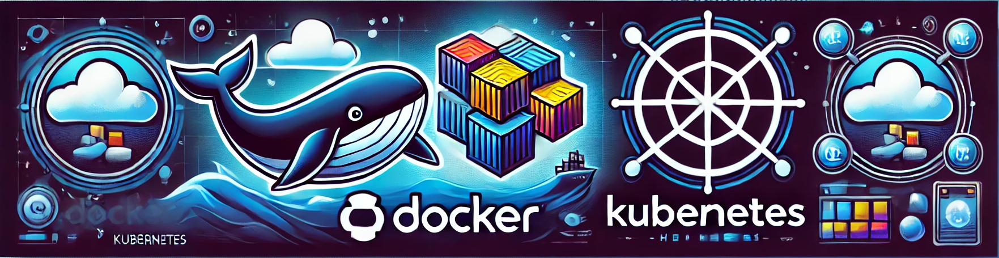

# Radicale Calendar Application on K3s

## Overview
This project sets up an auto-scaled calendar application using Radicale, Docker, and Kubernetes (K3s/K8s). The app is configured to work with persistent volumes.
It includes the following features:
- Three versions of Radicale: latest, stable, and test
- Docker image are built and pushed to Docker Hub dynamicly base on the three version 
- Kubernetes deployment with resource management, persistent volumes, services, and ingress for external access.

## Project Structure
- `Dockerfile`: Dynamic Dockerfile for different versions of Radicale
- `setup.sh`: Run interactive installation script
- `deployments`: Kubernetes deployment configuration files per Radicale's version
- `ingress.yaml`: Kubernetes ingress configuration for Radicale's version
- `pvc.yaml`: Kubernetes Persistent Volume Claims for Radicale's version
- `services`: Kubernetes service configuration files per Radicale's version
- `INSTALLATION.md`: Detailed installation instructions for setting
```
k8s_Radical
├── CONTRIBUTERS.md
├── Dockerfile
├── INSTALLATION.md
├── README.md
├── TASK.md
├── assets
│   ├── contribute.png
│   ├── installation.png
│   └── k8s_docker.png
├── config
│   ├── htpasswd
│   └── radicale.config
├── k8s
│   ├── deployment_latest.yaml
│   ├── deployment_stable.yaml
│   ├── deployment_test.yaml
│   ├── ingress.yaml
│   ├── pvc.yaml
│   ├── service_latest.yaml
│   ├── service_stable.yaml
│   └── service_test.yaml
└── setup.sh
```
